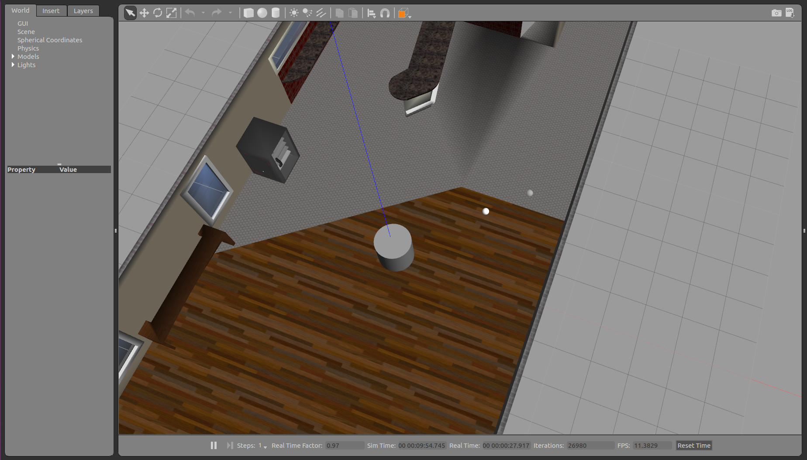

# Robot-Swarm-Persistent-Homology
A simulated swarm of robots creates a topological map of its environment. The robotic agents are represented by white spheres in the Gazebo environment. The agents move freely in the x-y-plane. They are subject to random pushes, so they perform a Brownian motion.

The location and timestamp of each contact between agents is recorded. When a simulation run is finished, a graph is constructed from the contact event database (TBD), and the Betti numbers of the corresponding simplicial complex are computed (TBD).



## Setup
Install ROS, Gazebo and x-term. Use `catkin_make` to build the ROS package.

## Usage
Start the simulation with the command

``` bash
$ roslaunch topological_swarm simulation.launch
```
Set the launch argument `use_rviz:=1` to visualize the agent model in RViz.

Contact events between agents are saved in a text file when a simulation run ends.
